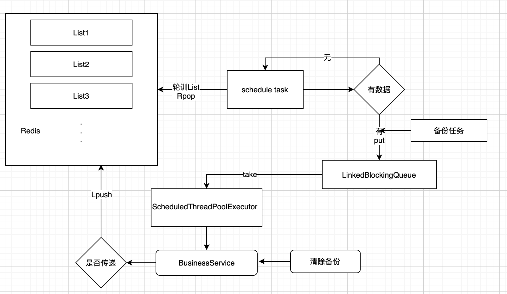

```
.
├── accountbal      余额账户记账
├── accountproduct  产品账户记账
├── accountreward   奖励金账户记账
├── activity        活动
├── advance         投资预处理
├── backsearch      支付反查
├── bindcard        绑卡
├── borrow          债权
├── common          公共基础包
├── investrecord    投资记录
├── pay             支付
├── payerror        支付失败
├── repayment       还款计划
└── workorder       工单

```
### introduction
功能模拟的是p2p投资理财的一些大概流程，功能包不是很全

采用redis List数据类型，实现的消息队列，

具体一点是客户端通过`RedisTemplate`，来向redis中的List中lpush数据，后台定时轮训redis中的List
rpop取数据，取到数据放入阻塞队列中，开启线程池`ScheduledThreadPoolExecutor`，多线程从阻塞队列中取数据
去消费

### flowchart



### features：

* 可以通过配置文件指定核心线程数（根据业务的拥挤性）
* 以及动态指定实现消费的业务逻辑类。

### usage
根目录下 `mvn clean package`,在运行每个项目的Launcher的main方法，
所有项目起来之后，可以模拟手动到redis中advance队列开始lpush一条数据
，查看该数据在所有队列中的流转